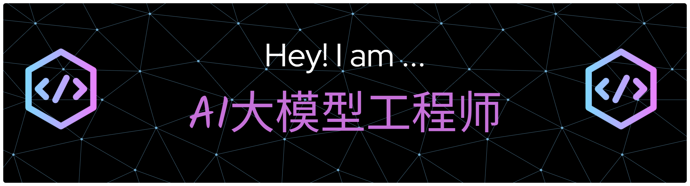

---------------
## Hi there 👋

我是程序员

## 这是一个二级标题

- 🌱 I’m currently learning AI
- 💬 Ask me about IT相关知识

---------

# Hi 👋, I'm GaoGao

### An experienced Javascript developer

- 🔭 I'm currently working on **AI 大模型**

- 💬 Ask me about **React、 Python 、NodeJS**

- 📝 I regularly write articles on **[https://gaomian.org](https://gaomian.org)**

<h3 align="left">Connect with me:</h3>

<h3 align="left">Languages and Tools:</h3>

                           

<!--
**NewBilility/NewBilility** is a ✨ _special_ ✨ repository because its `README.md` (this file) appears on your GitHub profile.

Here are some ideas to get you started:

- 🔭 I’m currently working on ...
- 🌱 I’m currently learning ...
- 👯 I’m looking to collaborate on ...
- 🤔 I’m looking for help with ...
- 💬 Ask me about ...
- 📫 How to reach me: ...
- 😄 Pronouns: ...
- ⚡ Fun fact: ...
-->
